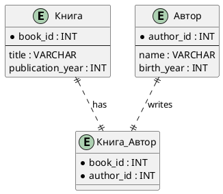

# Часть 1. Описание доменной области

Банк разрабатывает систему для учёта вкладов и накопительных счетов клиентов. Система должна хранить информацию о клиентах, их счетах, движениях средств, процентных ставках и начислении дохода. Администраторы используют её для анализа активности, контроля операций и формирования отчётности.

### Клиенты

В системе регистрируются физические лица. Хранятся их персональные данные, паспортная информация и контакты.  
Один клиент может открыть несколько вкладов или накопительных счетов.

### Счета

Поддерживаются два банковских продукта:
- **Вклад** — фиксированный срок, фиксированная ставка, возможные ограничения на снятие.    
- **Накопительный счёт** — бессрочный, допускает частые пополнения/снятия, ставка может изменяться.

Для каждого счёта фиксируются:
- дата открытия
- тип продукта
- валюта
- действующая процентная ставка
- статус (открыт / закрыт)

### Процентные ставки

Банк периодически обновляет ставки по продуктам. История изменений должна сохраняться — это необходимо для корректного расчёта доходности за разные периоды.

### Операции по счёту

Любое движение средств фиксируется как отдельная операция:
- пополнение
- снятие
- начисление процентов

Каждая операция содержит:
- дату
- сумму
- тип операции
- баланс счёта после операции

Операции не редактируются.

### Начисление процентов

Проценты начисляются:
- ежемесячно - для накопительных счетов
- в конце срока - для вкладов

Каждое начисление оформляется как отдельная операция.

### Использование данных администраторами

Система должна позволять:

- просматривать счета клиента    
- анализировать движение средств
- контролировать состояние вкладов
- отслеживать историю ставок
- формировать отчёты и агрегированные данные
- искать активных клиентов или аномальные операции

# Часть 2. Функциональные и нефункциональные требования

## Функциональные требования (FT)

### FT1. Клиенты

1. Система должна хранить данные о клиентах банка:
    - ФИО
    - дата рождения
    - паспортные данные
    - телефон
    - e-mail
2. Клиент может иметь любое число вкладов или накопительных счетов.

### FT2. Банковские продукты (счета)

1. Система должна поддерживать два продукта:
    - вклад
    - накопительный счёт
2. Для каждого счёта фиксируются:
    - дата открытия
    - тип продукта
    - валюта
    - действующая процентная ставка
    - статус (открыт / закрыт)

### **FT3. История процентных ставок**

1. Для каждого типа продукта должна храниться история изменений ставок.
2. Каждая запись должна включать:
    - тип продукта
    - размер процентной ставки
    - дату начала действия
3. История должна позволять определить ставку для любого периода.

### **FT4. Операции по счетам**

1. Для каждого счёта хранятся:
    - пополнения
    - снятия
    - начисления процентов
2. Каждая операция должна содержать:
    - дату операции
    - сумму
    - тип операции
    - баланс после операции
3. Операции должны быть неизменяемыми.

### **FT5. Начисление процентов**

1. Для вкладов проценты начисляются:
    - в конце срока
    - либо периодически, если продукт это предполагает
2. Для накопительных счетов проценты начисляются ежемесячно.
3. Каждое начисление процентов фиксируется как отдельная операция.

### **FT6. Аналитика и отчёты**

Система должна обеспечивать выполнение запросов, включая:

(Подробное описание запросов будет в соотвествующем блоке)

1. Баланс счёта на текущую дату или на произвольную дату.
2. Историю операций клиента.
3. Список активных счетов клиента.
4. Суммарные начисленные проценты за период.
5. Активность клиентов (есть операции / нет операций).
6. Количество новых счетов за указанный период.
7. Аналитику по процентным ставкам (например, средняя ставка по открытым счетам).

## Нефункциональные требования (NFT)

### **NFT1. Целостность данных**

1. Все зависимости должны иметь корректные внешние ключи.
2. Нельзя удалять данные, влияющие на финансовую историю (операции, ставки).
3. Паспортные данные клиента должны быть уникальны.
    
### **NFT2. Производительность**

1. Должны быть обеспечены индексы для высокой производительности
2. Запросы по операциям должны эффективно работать при большом объёме данных
    
### **NFT3. Масштабируемость**

1. Система должна поддерживать хранение большого количества операций (десятки тысяч).
2. Структура таблиц должна позволять дальнейшее расширение.

### **NFT4. Аудит**

1. Изменение статуса счёта должно фиксироваться в отдельной аудитной сущности или через операцию.    
2. История статусов должна сохраняться.

### **NFT5. Нормализация**

1. Схема должна соответствовать 3NF.
2. Справочники для типов операций и типов продуктов должны быть выделены в отдельные сущности.
3. Дублирование данных допускается только там, где это оправдано требованиями.

## Часть 3. Проектирование схемы базы данных (ER-диаграмма в PlantUML)

Вам необходимо самостоятельно спроектировать структуру базы данных для системы на основе предметной области и функциональных требований.

### **Что нужно сделать**

1. Разработать **ER-диаграмму в PlantUML**, которая отражает бизнес-логику:    
    - клиенты
    - банковские продукты (вклад, накопительный счёт)
    - операции по счетам
    - историю процентных ставок
    - дополнительные сущности по необходимости (справочники, статусы, аудит)
2. Обязательные элементы диаграммы:
    - сущности
    - первичные и внешние ключи (PK / FK)
    - связи с указанием кратностей
    - описание ключевых атрибутов
3. Названия сущностей и полей выбираете **сами**, логичные для предметной области.
4. Продумайте связи:
    - 1:N (например, клиент → счета)
    - N:M при необходимости
    - 1:1, если логика продукта это требует
5. Схема должна быть нормализована как минимум до 3NF.
### Пример синтаксиса PlantUML 

**Пояснения к примеру:**
- `*` указывает на первичный ключ (PK)
- Таблица `BookAuthor` показывает, как реализовать связь N:M
- Основные атрибуты выделены, подробные поля можно добавлять по необходимости

## Часть 4. Реализация схемы в SQL

На основе созданной вами ER-диаграммы необходимо подготовить SQL-скрипты для создания структуры базы данных и наполнения её минимальным набором тестовых данных.

### **4.1. SQL DDL — создание структуры БД**

Создайте SQL-скрипт, который должен включать:

1. **Определение всех таблиц (CREATE TABLE)** согласно вашей модели. 
2. Проставление всех ключей:
    - **PRIMARY KEY**
    - **FOREIGN KEY** (каждая связь из ER-модели должна быть отражена)
    - **UNIQUE / CHECK** — если применимо
    - **NOT NULL** — по необходимости
3. Создание необходимых индексов.
4. **Комментариев (COMMENT ON …)**:
    - комментарии к таблицам
    - комментарии к полям  (при необходимости)

### **4.2. Заполнение тестовыми данными**

Этот блок должен быть оформлен отдельными SQL-вставками (INSERT INTO …).

#### Минимальные требования к объёму данных:
- Клиентов — **не менее 3**.
- Вкладов и/или накопительных счетов — **не менее 5**, распределённых между клиентами.
- История изменений ставок (если есть таблица) — **минимум 3 записи**.
- Операций по счетам — **не менее 10**, относящихся к разным клиентам и разным продуктам.
- Все внешние ключи должны корректно ссылаться на существующие записи.

## Часть 5. SQL-запросы к вашей модели

Выполните все запросы, используя свою модель данных.  
Формулировки описывают, _что_ нужно получить, без указания конкретных таблиц или колонок.

##  Список  запросов

1. Получить список всех активных вкладов или накопительных счетов конкретного клиента с указанием названия продукта.
2. Показать все операции по выбранному счёту за заданный период времени, включая название продукта, к которому относится счёт.
3. Вывести хронологическую историю изменений процентной ставки для каждого финансового продукта, используемого хотя бы одним активным счётом, с названием продукта.
4. Определить, сколько процентов было начислено на конкретный счёт за выбранный период.
5. Найти всех клиентов, у которых есть хотя бы один финансовый продукт со ставкой выше указанного значения.
6. Подсчитать общий объём средств, размещённых на счетах определённого типа (например, накопительных).
7. Определить клиентов, у которых открыто больше одного вклада или счёта.
8. Сформировать статистику: для каждого клиента — количество операций за последний месяц.
9. Определить пяти клиентов с наибольшим оборотом операций за выбранный период.
10. Получить список финансовых продуктов, процентная ставка по которым хотя бы раз изменялась за последний год.
11. Найти счета, по которым отсутствовали операции дольше указанного количества дней.
12. Для каждого клиента определить его наиболее прибыльный продукт, где прибыль — сумма начисленных процентов или аналогичная метрика по вашей модели.
13. Найти счета, по которым за короткий промежуток времени происходило подозрительно много операций (например, более заданного количества операций за определённый интервал).
14. Определить клиентов, чьи переводы значительно превышают типичные значения по системе, где "значительно" определяется статистически (например, выше среднего с учётом отклонений).
15. Построить рейтинг финансовых продуктов по приросту активов за последние 90 дней, где прирост определяется разницей между начальным и конечным объёмом средств или суммой операций за период.
16. Налоги: найти клиентов, у которых суммарная прибыль по продуктам превысила 250 000 рублей за период.
	- Контекст: по законодательству РФ физические лица платят 13 % НДФЛ с прибыли свыше порога.
	- Что вывести: ID клиента и сумму налога (13 % от прибыли)    
	- Требования: учитывать все продукты клиента, выводить только тех, у кого прибыль > 250 000 руб.
17. Лимиты по операциям: найти клиентов, у которых сумма всех снятий с накопительных счетов за последний месяц превысила 1 000 000 рублей.
	- Контекст: банк контролирует крупные операции по требованиям комплаенса и ФЗ-115 РФ.    
	- Что вывести: ID клиента, общую сумму снятий, количество операций, превышающих 100 000 руб.    
	- Требования: учитывать все накопительные счета клиента, включать только операции снятия, сортировать по сумме снятий по убыванию.

Разбивка по баллам:

| №   | Описание запроса                                                                                            | Баллы |
| --- | ----------------------------------------------------------------------------------------------------------- | ----- |
| 1   | Список всех активных вкладов или накопительных счетов конкретного клиента с названием продукта              | 5     |
| 2   | Все операции по выбранному счёту за период с названием продукта                                             | 5     |
| 3   | Хронологическая история изменений процентной ставки для продуктов с активными счетами, с названием продукта | 5     |
| 4   | Сумма начисленных процентов на конкретный счёт за период                                                    | 10    |
| 5   | Клиенты с хотя бы одним продуктом со ставкой выше указанного значения                                       | 10    |
| 6   | Общий объём средств на счетах определённого типа                                                            | 10    |
| 7   | Клиенты с более чем одним вкладом или счётом                                                                | 10    |
| 8   | Количество операций за последний месяц по каждому клиенту                                                   | 10    |
| 9   | Пять клиентов с наибольшим оборотом операций за период                                                      | 15    |
| 10  | Продукты, по которым ставка изменялась хотя бы раз за последний год                                         | 10    |
| 11  | Счета без операций дольше указанного количества дней                                                        | 15    |
| 12  | Для каждого клиента определить наиболее прибыльный продукт                                                  | 15    |
| 13  | Счета с подозрительно большим числом операций за короткий период                                            | 15    |
| 14  | Клиенты с переводами, значительно превышающими средние значения по системе                                  | 15    |
| 15  | Рейтинг продуктов по приросту активов за 90 дней                                                            | 20    |
| 16  | Клиенты с прибылью выше 250 000 руб. и сумма налога 13 %                                                    | 15    |
| 17  | Клиенты с суммой снятий свыше 1 000 000 руб. за месяц                                                       | 15    |

## Часть 6. Как выполнять задание

- **Этапы выполнения**
    1. Проектирование: заполнить `1_er_diagram/er_diagram.puml` с таблицами, ключами и связями.
    2. DDL: создать таблицы, ключи, индексы и комментарии в `2_ddl/ddl.sql`.        
    3. Данные: вставить тестовые записи в `3_data/data.sql` (минимум 3 клиента, 5 счетов, 10 операций).
    4. SQL-запросы: реализовать задания в `4_queries/qXX_*.sql`, добавляя комментарии.
    5. README: проверить, что все файлы корректно подключены через `include::` и отображаются с подсветкой кода и PlantUML диаграммой.
- **Важно**
    - **Нельзя менять имена файлов** и создавать новые.
    - Соблюдать структуру папок.
    - Проверять выполнение SQL в PostgreSQL.
    - Использовать подзапросы, временные таблицы и агрегаты, если это требуется заданием.
    - Комментарии к таблицам, полям и запросам обязательны.
- **Сдача работы**        
    - README.adoc агрегирует все файлы и служит основой для проверки.
    - Проверяющий проверит работу и даст свои комментарии, после чего их нужно будет исправить 

## Часть 7. Дополнительное задание: блокировка счетов

> Запрещено выполнять вместе с основным заданием, вы должны изменить уже созданную структуру
### Описание

- В системе появляется новое состояние счетов: **заблокированный**.
- Необходимо реализовать работу с этим состоянием: выборка доступных счетов, обновление состояния и аналитика с учётом всех состояний.    

### Задание 1. Доступные счета с суммой операций за месяц

- Вывести все счета клиента, которые доступны для операций.
- Для каждого счета вывести:
    - ID счета
    - Тип счета
    - Текущее состояние
    - Сумму операций за последний месяц
- Условие: берём операции за период с `2025-10-01` по `2025-10-31`.

### Задание 2. Блокировка счетов по условию

- Заблокировать все счета, по которым **сумма операций за последний месяц превышает 1 000 000**.    
- Показать результат:
    - ID счета
    - Тип счета
    - Новое состояние
- Условие: период операций с `2025-10-01` по `2025-10-31`.
### Задание 3. Аналитика по состояниям счетов

- Для каждого клиента показать:
    - ID клиента
    - Имя клиента
    - Сумму по активным счетам
    - Сумму по заблокированным счетам
    - Количество операций по активным счетам
    - Количество операций по заблокированным счетам
- Условие: берём все операции за последний месяц (`2025-10-01` – `2025-10-31`).

Баллы за дополнительные задания

| Задание | Описание                                   | Баллы |
| ------- | ------------------------------------------ | ----- |
| 7.1     | Доступные счета с суммой операций за месяц | 10    |
| 7.2     | Блокировка счетов по условию               | 15    |
| 7.3     | Аналитика по состояниям счетов             | 20    |

